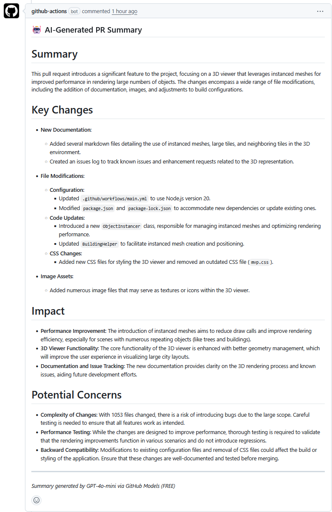

# PR Summarizer GitHub Action (FREE)

Automatically generate AI-powered summaries for your pull requests using **GitHub Models** - completely free!

## Features

- 🆓 **100% FREE** - Uses GitHub Models API (no API keys needed!)
- 🤖 Automatic PR summarization when PRs are opened or updated
- 📊 Analyzes code changes, file modifications, and PR descriptions
- 💬 Posts summary as a comment directly on the PR
- 🎯 Highlights key changes, impact, and potential concerns
- ⚡ Powered by GPT-4o-mini via GitHub's AI infrastructure

## Demo



## Setup Instructions

### 1. Add to Your Repository

Copy the `.github` folder structure to your repository:

```
your-repo/
├── .github/
│   ├── workflows/
│   │   └── pr-summary.yml
│   └── scripts/
│       ├── package.json
│       └── summarize-pr.js
```

### 2. That's It! 🎉

No API keys needed! The action uses your repository's `GITHUB_TOKEN` which is automatically provided by GitHub Actions. This token gives you FREE access to GitHub Models.

### 3. Commit and Push

Commit the workflow files to your repository:

```bash
git add .github/
git commit -m "Add PR summarizer GitHub Action"
git push
```

### 4. Test It Out

Create a new pull request and watch the action run! Within a minute or two, you should see:
- The action running in the **Actions** tab
- A comment posted on your PR with the AI-generated summary

## How It Works

1. **Trigger**: Activates when a PR is opened or updated (`synchronize`)
2. **Fetch**: Retrieves PR metadata, description, files changed, and the diff
3. **Analyze**: Sends the information to GPT-4o-mini via GitHub Models API (FREE)
4. **Summarize**: The AI generates a structured summary including:
   - High-level overview
   - Key changes by component
   - Impact assessment
   - Potential concerns or breaking changes
5. **Post**: Adds the summary as a comment on the PR

## Customization

### Change the Trigger Events

Edit `.github/workflows/pr-summary.yml`:

```yaml
on:
  pull_request:
    types: [opened, synchronize, reopened]  # Add more events
```

### Adjust Summary Format

Edit the prompt in `.github/scripts/summarize-pr.js` to change what AI focuses on:

```javascript
const prompt = `Please analyze this pull request and provide...
// Customize the instructions here
`;
```

### Use a Different Model

GitHub Models supports multiple models. Change in `summarize-pr.js`:

```javascript
// Available FREE models:
model: 'gpt-4o-mini',        // Fast, efficient (recommended)
model: 'gpt-4o',             // More capable, slower
model: 'Meta-Llama-3.1-405B-Instruct', // Open source alternative
```

### Limit to Specific Branches

Add branch filtering to the workflow:

```yaml
on:
  pull_request:
    types: [opened, synchronize]
    branches:
      - main
      - develop
```

## Troubleshooting

### Action Fails with API Error
- The action uses GitHub's built-in `GITHUB_TOKEN` - no setup needed
- Ensure your repository has Actions enabled
- Check the Actions tab for detailed error logs

### Permission Errors
- The workflow includes required permissions in the YAML
- If issues persist, check your repository settings → Actions → General → Workflow permissions

### Summary Not Posting
- Check the Actions tab for error logs
- Ensure `pull-requests: write` permission is enabled
- Verify the `GITHUB_TOKEN` has appropriate access

### Large PRs Timing Out
- The script truncates diffs at ~15,000 characters
- For very large PRs, consider fetching only changed files instead of the full diff

## Cost Considerations

**Completely FREE!** 🎉

GitHub Models provides free access to AI models including GPT-4o-mini, GPT-4o, and Llama models. No credit card required, no usage limits for reasonable use.

Rate limits:
- 15 requests per minute
- 150 requests per hour
- 1,500 requests per day

For most repositories, this is more than enough!

## Advanced: Running Locally

Test the script locally before deploying:

```bash
cd .github/scripts
npm install

export GITHUB_TOKEN="your_github_personal_access_token"
export REPO_OWNER="owner"
export REPO_NAME="repo"
export PR_NUMBER="123"

node summarize-pr.js
```

Note: Your GitHub personal access token needs the `repo` scope to access GitHub Models API.

## Security Notes

- No API keys needed - uses GitHub's built-in authentication
- The `GITHUB_TOKEN` is automatically scoped to your repository
- Token expires after the workflow completes
- Review the permissions in the workflow file and adjust as needed
- All API calls stay within GitHub's infrastructure

## License

MIT

## Contributing

Feel free to customize this action for your needs! Some ideas:
- Add support for labeling PRs based on changes
- Integrate with Slack/Discord notifications
- Generate commit message suggestions
- Add code quality metrics

---

Built with ❤️ using [GitHub Models](https://github.com/marketplace/models) - FREE AI for everyone!
